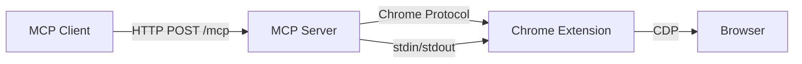
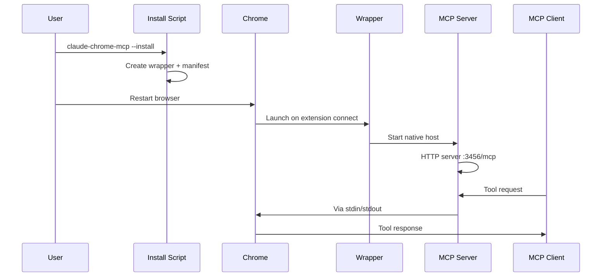

# AGENTS.md - Developer Guide

Developer guidance for AI agents working on this codebase.

## Project Overview

MCP server that bridges the Claude Chrome Extension with MCP clients via Chrome native messaging protocol.

## Project Rules

- Use Bun exclusively (no npm)
- No emoji in output or documentation
- No ASCII boxes in output

## Essential Commands

```bash
bun run build                # Compile TypeScript to dist/
bun run dev                  # Watch mode
bun test                     # Run all tests
bun test/unit/<name>.test.js # Run specific test

bun install                  # Install dependencies
bun run build && bun link    # Local dev setup

claude-chrome-mcp --install  # Register native host (auto-generates token)
claude-chrome-mcp --status   # Check installation and view token
claude-chrome-mcp --uninstall # Remove installation
```

## Code Style (Critical)

**Imports:**
- MUST use `.js` extension for imports even in `.ts` files:
  ```typescript
  import { ChromeMcpServer } from './server.js';  // Correct
  import { ChromeMcpServer } from './server';     // Wrong
  ```
- ESM syntax only (no `require`)
- Named imports, no default exports

**TypeScript:**
- Strict mode enabled - explicit types required
- Use `unknown` instead of `any`
- Zod schemas for runtime validation

**Naming:**
- Classes/Interfaces: PascalCase
- Functions/Variables: camelCase
- Constants: UPPER_SNAKE_CASE
- Files: kebab-case

**Formatting:**
- 2-space indentation
- Single quotes for strings
- Semicolons required
- JSDoc comments for exported functions/classes

## Architecture



**Key files:**
- `src/mcp-server.ts` - HTTP server, registers tools, manages sessions
- `src/chrome-protocol.ts` - Chrome native messaging (length-prefixed JSON on stdin/stdout)
- `src/tools.ts` - 14 browser tools with Zod schemas
- `src/instructions.ts` - Server instructions (~600 words, delivered in MCP initialize)
- `src/install.ts` - Installation (creates wrapper + manifest, detects Bun/Node runtime)

## Server Instructions (src/instructions.ts)

Guidelines for maintaining `SERVER_INSTRUCTIONS`:
- Focus on cross-tool workflows and operational patterns
- Document constraints (60s timeouts, alert/dialog blocking)
- Include critical warnings
- NO tool descriptions (in schemas already)
- NO marketing language
- Test validates: 500+ words, covers GIF/console/alerts/tabs/timeouts

## How It Works



**Auto-initialization:** Tab groups created automatically by extension when `tabs_context` called

## Adding a Tool

1. Add to `src/tools.ts`:
   ```typescript
   export const myTool: ToolDefinition = {
     name: 'my_tool',
     description: 'Brief description',
     inputSchema: z.object({
       param: z.string().describe('Parameter description'),
     }),
   };
   ```
2. Add to `allTools` array
3. Rebuild: `bun run build`

## Testing

**Unit tests** use Node.js built-in `assert`:
- `test/unit/auth-cors.test.js` - Authentication/CORS middleware
- `test/unit/runtime-detection.test.js` - Bun/Node detection
- `test/unit/instructions.test.js` - Validates server instructions

**Manual integration testing** requires Chrome extension installed

## Common Issues

**Build errors:**
- Clean: `rm -rf dist/ && bun run build`
- Check imports use `.js` extension
- Verify all types explicit (strict mode)

**Runtime errors:**
- "Port in use": `lsof -i :3456` (Linux/Mac) or `netstat -ano | findstr :3456` (Windows)
- "Connection timeout": Chrome extension not connected
- Tool timeout: 60s limit, break into smaller operations

**Installation:**
- Run `claude-chrome-mcp --status` to verify
- Restart Chrome completely after install/uninstall
- Wrapper must be executable (Unix)

## Security

- HTTP binds to 127.0.0.1 only
- Bearer token auth (auto-generated by default)
- Native messaging manifest restricts to specific extension ID
- Configurable CORS origins

## Wire Protocol

Chrome Native Messaging: `[4 bytes length (little-endian)] [N bytes JSON (UTF-8)]`
