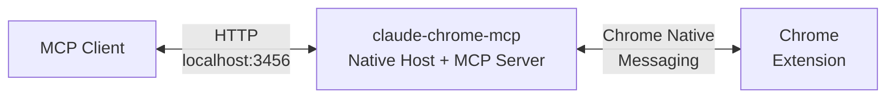
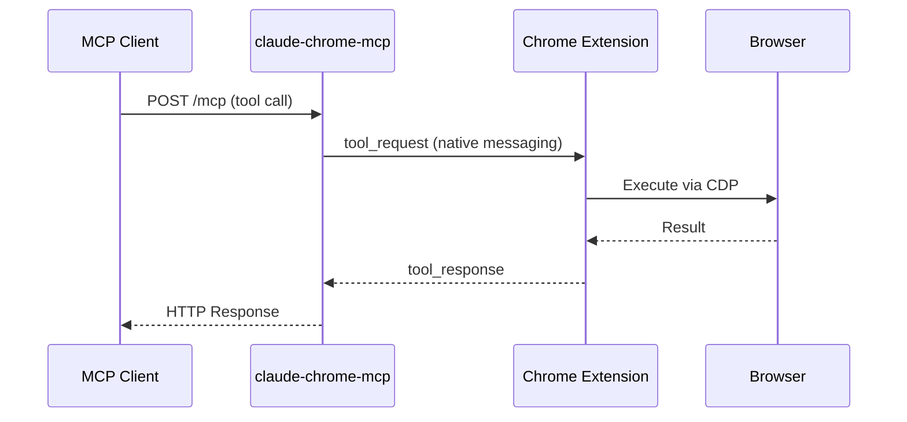

# Claude Chrome MCP

> Model Context Protocol server for browser automation via the Claude Chrome Extension

A unified native host and MCP HTTP server that enables programmatic control of Chrome through the [Claude Browser Extension](https://claude.com/chrome). Connect any MCP-compatible client to automate browser interactions.

## Features

- **Works with Claude.com Extension**: Integrates seamlessly with the official [Claude Chrome Extension](https://claude.com/chrome)
- **Zero Configuration**: Automatic native host installation and Chrome integration
- **MCP Standard**: Full compliance with Model Context Protocol over HTTP
- **14 Browser Tools**: Navigate, interact, read content, manage tabs, debug, and more
- **Multi-Client**: Support multiple simultaneous MCP client connections
- **Type-Safe**: Built with TypeScript for reliability

## Architecture



## Quick Start

### 1. Install the Claude Browser Extension

Visit [claude.com/chrome](https://claude.com/chrome) to install the official Claude Browser Extension.

### 2. Install and Configure MCP Server

```bash
# Install globally
npm install -g claude-chrome-mcp

# Register as Chrome native messaging host
claude-chrome-mcp --install

# Restart Chrome completely (required for native host registration)
```

That's it! Chrome will now automatically launch the MCP server when the extension connects.

### 3. Configure Your MCP Client

Configure your MCP client (Claude Desktop, Cline, Continue, etc.) to connect:

```json
{
  "mcpServers": {
    "claude_chrome": {
      "transport": {
        "type": "http",
        "url": "http://localhost:3456/mcp"
      }
    }
  }
}
```

Or run directly with npx (no installation needed):

```bash
npx claude-chrome-mcp --install
```

## Prerequisites

### Required

1. **Claude Browser Extension** - Install from [claude.com/chrome](https://claude.com/chrome)
   - Official extension ID: `fcoeoabgfenejglbffodgkkbkcdhcgfn`
   - Required for browser automation capabilities

2. **Node.js** 18.0.0 or later
   - [Download from nodejs.org](https://nodejs.org/)

### Supported Browsers

- Google Chrome
- Chromium
- Brave (Chromium-based)
- Microsoft Edge (Chromium-based)

> **Note**: The extension must be installed and active in your browser for the MCP server to function.

## CLI Reference

```bash
# Install native host manifest
claude-chrome-mcp --install

# Install with custom extension ID
claude-chrome-mcp --install --extension-id YOUR_EXTENSION_ID

# Check installation status
claude-chrome-mcp --status

# Uninstall
claude-chrome-mcp --uninstall

# Show help
claude-chrome-mcp --help
```

## Available Tools

The server exposes 14 browser automation tools:

### Navigation
| Tool | Description |
|------|-------------|
| `navigate` | Navigate to URLs, back/forward |

### Interaction
| Tool | Description |
|------|-------------|
| `computer` | Click, type, scroll, screenshot, keyboard |
| `form_input` | Fill text inputs, select dropdowns |
| `find` | Search for elements by text |

### Content
| Tool | Description |
|------|-------------|
| `read_page` | Get DOM with element references |
| `get_page_text` | Extract visible text content |

### Tab Management
| Tool | Description |
|------|-------------|
| `tabs_context` | List tabs in browser tab group |
| `tabs_create` | Create new tab in browser tab group |
| `resize_window` | Resize browser window |

### Debugging
| Tool | Description |
|------|-------------|
| `read_console_messages` | Read browser console |
| `read_network_requests` | Read network activity |

### Media
| Tool | Description |
|------|-------------|
| `upload_image` | Upload image via drag-drop |
| `gif_creator` | Record actions as GIF |

### Code Execution
| Tool | Description |
|------|-------------|
| `javascript_tool` | Execute JavaScript in page context |

## Examples

### Navigate to a URL

```json
{
  "tool": "navigate",
  "arguments": {
    "url": "https://example.com"
  }
}
```

### Click an Element

```json
{
  "tool": "computer",
  "arguments": {
    "action": "left_click",
    "ref": "ref_1"
  }
}
```

### Take a Screenshot

```json
{
  "tool": "computer",
  "arguments": {
    "action": "screenshot"
  }
}
```

### Execute JavaScript

```json
{
  "tool": "javascript_tool",
  "arguments": {
    "action": "javascript_exec",
    "text": "document.title"
  }
}
```

## Architecture

## Architecture

### Message Flow



### Wire Protocol

Chrome native messaging uses length-prefixed JSON:

```
┌────────────────┬────────────────────────────────────┐
│  Length (4B)   │  JSON Payload                      │
│  Little-endian │  UTF-8 encoded                     │
└────────────────┴────────────────────────────────────┘
```

## Troubleshooting

### Check Installation Status

```bash
claude-chrome-mcp --status
```

### Native Host Not Starting

1. Ensure Chrome is completely restarted after installation
2. Check if manifest exists:
   - Linux: `~/.config/chromium/NativeMessagingHosts/com.anthropic.claude_code_browser_extension.json`
   - macOS: `~/Library/Application Support/Google/Chrome/NativeMessagingHosts/`
3. Verify wrapper script exists: `~/.local/share/claude-chrome-mcp/`

### Connection Issues

1. Check if port 3456 is available (or if server chose a different port)
2. Ensure Chrome extension is installed and enabled
3. Check Chrome extension logs: `chrome://extensions` → Details → Inspect views

### Permission Errors

The Chrome extension requires permissions for each domain. When first interacting with a new domain, you may need to approve it in Chrome.

### Custom Extension ID

If using a custom or development version of the Chrome extension:

```bash
claude-chrome-mcp --install --extension-id YOUR_EXTENSION_ID
```

### Debugging

Check native host logs (all logging goes to stderr):
- Chrome intercepts and logs native host stderr to the extension console
- Open `chrome://extensions` → Claude Extension → Details → Inspect views → Service Worker
- Look for native host connection messages

## Contributing

Contributions are welcome! Please see:
- [CONTRIBUTING.md](./CONTRIBUTING.md) - Contribution guidelines and workflow
- [AGENTS.md](./AGENTS.md) - Development guidelines and coding standards
- [docs/](./docs/) - Technical architecture and developer documentation

## License

MIT License - see [LICENSE](./LICENSE) file for details.

## Related Projects

- [Claude Browser Extension](https://claude.com/chrome) - Official Chrome extension for browser automation
- [Model Context Protocol](https://modelcontextprotocol.io) - MCP specification and documentation
- [Claude Desktop](https://claude.ai/download) - Desktop app with built-in MCP client support
