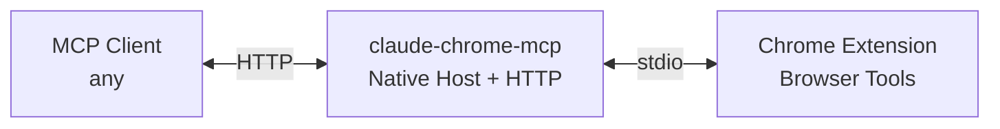

# Developer Documentation

This directory contains technical documentation for developers working with or extending `claude-chrome-mcp`.

## Architecture Overview

`claude-chrome-mcp` is a self-contained MCP server that acts as a native messaging host for the [Claude Browser Extension](https://chromewebstore.google.com/detail/claude/fcoeoabgfenejglbffodgkkbkcdhcgfn).



### Key Components

1. **Native Host** (`src/native-host.ts`)
   - Implements Chrome native messaging protocol
   - Reads/writes length-prefixed JSON on stdin/stdout
   - Launched automatically by Chrome when extension connects

2. **HTTP Server** (`src/unified-server.ts`)
   - Exposes MCP tools via HTTP endpoint `/mcp`
   - Handles multiple concurrent client connections
   - Routes requests to Chrome extension via native host

3. **Tool Definitions** (`src/tools.ts`)
   - 14 browser automation tools with Zod schemas
   - MCP-compliant tool registration
   - Input validation and type safety

4. **Installation** (`src/install.ts`)
   - Creates native messaging manifest
   - Generates wrapper script
   - Platform-aware (Linux, macOS, Windows)

## Wire Protocol

### Chrome Native Messaging

Messages consist of two parts:

| Component | Size | Format |
|-----------|------|--------|
| Length | 4 bytes | Little-endian unsigned integer |
| Payload | N bytes | UTF-8 encoded JSON |

### HTTP/MCP

Standard HTTP POST requests to `/mcp` endpoint with JSON-RPC 2.0 format.

## Available Tools

| Category | Tools |
|----------|-------|
| **Navigation** | navigate |
| **Interaction** | computer, form_input, find |
| **Content** | read_page, get_page_text |
| **Tab Management** | tabs_context, tabs_create, resize_window |
| **Debugging** | read_console_messages, read_network_requests |
| **Media** | upload_image, gif_creator |
| **Code Execution** | javascript_tool |

## Development

### Building

```bash
npm install
npm run build
```

### Testing

```bash
# Install for local testing
npm run install-native-host

# Check status
npm run status

# Restart Chrome and test with an MCP client
```

### Code Style

See [AGENTS.md](../AGENTS.md) for detailed coding standards:
- TypeScript strict mode
- ESM imports with `.js` extensions
- Zod schemas for validation
- JSDoc comments for public APIs

## Installation Workflow

1. User runs: `claude-chrome-mcp --install`
2. Script creates:
   - Wrapper script at `~/.local/share/claude-chrome-mcp/wrapper.sh`
   - Native messaging manifest in browser's config directory
3. User restarts Chrome
4. Extension connects → Chrome launches wrapper → wrapper starts `claude-chrome-mcp`
5. Native host accepts extension connection on stdin/stdout
6. HTTP server starts on port 3456
7. MCP clients can connect

## Platform Support

| Platform | Status | Notes |
|----------|--------|-------|
| Linux | ✅ Tested | Uses `~/.config/google-chrome/` or `chromium/` |
| macOS | ✅ Supported | Uses `~/Library/Application Support/` |
| Windows | ✅ Supported | Uses named pipes instead of stdin/stdout |

## Security

- HTTP server binds to `127.0.0.1` (localhost only)
- Native messaging manifest restricts to specific extension ID
- Wrapper script uses absolute paths
- No external network access required

## Contributing

See [CONTRIBUTING.md](../CONTRIBUTING.md) for:
- Development setup
- Coding guidelines
- Pull request process
- Areas for contribution

## Troubleshooting

### Common Issues

1. **Native host not starting**
   - Verify wrapper script is executable
   - Check Chrome extension console for errors
   - Ensure Chrome is fully restarted after installation

2. **Connection refused**
   - Port 3456 may be in use
   - Check if native host process is running

3. **Tool execution fails**
   - Extension must be active
   - Browser must have required permissions for domain
   - Tab must be open with accessible page

For more help, see main [README.md](../README.md) troubleshooting section.
